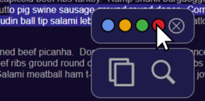

# 📖 Mark My Book

An interactive platform to search books, highlight text in various styles, and save your favorite books.
The books on the landing page are being mocked. To pass all tests please uncomment the code in the getAllBooks.ts file.

🔗[View Live Site](https://digital-library-lovat.vercel.app/)

## **Tech Stack**

- **Next.js** – Modern React Framework
- **Leaflet** - Interactive map
- **React Query** - Asynchronous state management in client components
- **TypeScript** – Strongly typed JavaScript
- **SASS** – CSS extension language
- **Jest & Testing Library** – Unit and integration testing

## Features

✔️ **Advanced Text Highlighting** - Highlight text in multiple ways.  
✔️ **Google Books API** – Search and access a vast collection of books.  
✔️ **Responsive design** – Works on all screen sizes  
✔️ **BEM** – CSS methodology  
✔️ **Accessibility for screen readers**

## **How to highlight a text**

First, select the text you want to highlight, right-click on it and, if the selection is valid, the context menu will open and now just click on the color you want to use.



You can try extending highlighted text in different colors, combine plain text and highlighted text, remove highlighting and other options from the context menu.

## **Installation & Setup**

1️⃣ Clone this repository:

```bash
git clone https://github.com/DDev-max/Digital-Library.git
```

2️⃣ Navigate into the project directory:

```bash
cd Digital-Library
```

3️⃣ Install dependencies:

```bash
npm install
```

4️⃣ Run the project locally:

```bash
npm run dev
```
